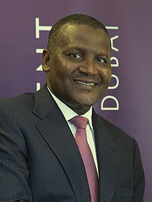
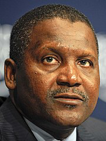

![ref1]

**Created with an evaluation copy of Aspose.Words. To remove all limitations, you can use Free Temporary License [https://products.aspose.com/words/temporary-license/**](https://products.aspose.com/words/temporary-license/)**

 

**Aliko Dangote**

**Evaluation Only. Created with Aspose.Words. Copyright 2003-2024 Aspose Pty Ltd.**
![ref2]

**Aliko  Dangote**  (born  10  April  1957)  is  a  Nigerian businessman and industrialist. He is the first man who built  a  private  refinery  in  Nigeria.  The  *[Bloomberg Billionaires  Index*](https://en.wikipedia.org/wiki/Bloomberg_Billionaires_Index)*  estimated  his  net  worth  at  [$](https://en.wikipedia.org/wiki/US_dollar)28 billion in October 2024[\[1\]](#_page4_x26.25_y66.75)[\[2\]](#_page4_x26.25_y96.75)[\[3\]](#_page4_x26.25_y140.25)

**Early life**

Dangote  was  born  on  10 April  1957  into  a  wealthy [Hausa](https://en.wikipedia.org/wiki/Hausa_people) [Muslim](https://en.wikipedia.org/wiki/Muslims) family in [Kano](https://en.wikipedia.org/wiki/Kano_\(city\)), which was then part of

[British  Nigeria](https://en.wikipedia.org/wiki/British_Nigeria).[\[4\]](#_page4_x26.25_y170.25)[\[5\]](#_page4_x26.25_y213.75)[\[6\]](#_page4_x26.25_y257.25)  His  mother,  Mariya  Sanusi Dantata,  was  the  daughter  of  businessman  [Sanusi](https://en.wikipedia.org/wiki/Sanusi_Dantata)

[Dantata](https://en.wikipedia.org/wiki/Sanusi_Dantata).[\[7\]](#_page4_x26.25_y287.25)  His  father,  Mohammed  Dangote,  was  a business associate of Dantata.[\[8\]](#_page4_x26.25_y330.75) Through his mother, he  is  the  great-grandson  of  [Alhassan  Dantata](https://en.wikipedia.org/wiki/Alhassan_Dantata),  the richest person in [West Africa](https://en.wikipedia.org/wiki/West_Africa) at the time of his death in 1955.[\[9\]](#_page4_x26.25_y360.75) Dangote's brother, [Sani](https://en.wikipedia.org/wiki/Sani_Dangote) (1959/60–2021), was also  a  businessman.[\[10\]](#_page4_x26.25_y404.25)[\[11\]](#_page4_x26.25_y461.25)  Dangote  was  educated  at the Sheikh Ali Kumasi [Madrasa](https://en.wikipedia.org/wiki/Madrasa), followed by Capital

High School in Kano.[\[12\]](#_page4_x26.25_y491.25) In 1978, he graduated from the [Government College, Birnin Kudu](https://en.wikipedia.org/wiki/Government_College,_Birnin_Kudu).[\[13\]](#_page4_x26.25_y561.75) He received a  [bachelor's  degree](https://en.wikipedia.org/wiki/Bachelor%27s_degree)  in  business  studies  and administration  from  [Al-Azhar  University](https://en.wikipedia.org/wiki/Al-Azhar_University)  in

[Cairo](https://en.wikipedia.org/wiki/Cairo).[\[14\]](#_page4_x26.25_y591.75)[\[12\]](#_page4_x26.25_y491.25)

**Business career**

The [Dangote Group](https://en.wikipedia.org/wiki/Dangote_Group) was established as a small trading firm  in  1977,  the  same  year  Dangote  relocated  to [Lagos](https://en.wikipedia.org/wiki/Lagos) to expand the company.[\[5\]](#_page4_x26.25_y213.75) Dangote received a [₦](https://en.wikipedia.org/wiki/Nigerian_naira)500,000  loan  from  his  uncle  to  begin  trading  in commodities,  including  bagged  [cement](https://en.wikipedia.org/wiki/Cement)  as  well  as agricultural goods like rice and sugar.[\[15\]](#_page4_x26.25_y621.75) In the 1990s,

he approached the [Central Bank of Nigeria](https://en.wikipedia.org/wiki/Central_Bank_of_Nigeria) with the idea that it would be less expensive for the bank to allow his transport company to manage their fleet of staff buses, a proposal that was also approved.

**Aliko Dangote**

[GCON](https://en.wikipedia.org/wiki/Order_of_the_Niger)

Dangote in 2014

**Born** Aliko Dangote

10 April 1957

[Kano,](https://en.wikipedia.org/wiki/Kano_\(city\)) British Nigeria **Education** [Government College, Birnin](https://en.wikipedia.org/wiki/Government_College,_Birnin_Kudu)

[Kudu](https://en.wikipedia.org/wiki/Government_College,_Birnin_Kudu)

**Alma mater** [Al-Azhar University ](https://en.wikipedia.org/wiki/Al-Azhar_University)**Occupations** Businessman **·** industrialist **Years active** 1977–present

**Spouses** Zainab Dangote

(m. 1977, divorced) 

Mariya Muhammad Rufai (divorced) 

**Children** 4, including [Halima ](https://en.wikipedia.org/wiki/Halima_Dangote)**Relatives** [Alhassan Dantata (g](https://en.wikipedia.org/wiki/Alhassan_Dantata)reat-

grandfather)

[Sanusi Dantata (](https://en.wikipedia.org/wiki/Sanusi_Dantata)grandfather) [Aminu Dantata ](https://en.wikipedia.org/wiki/Aminu_Dantata)(grand-uncle) [Sani Dangote (](https://en.wikipedia.org/wiki/Sani_Dangote)brother)

**Evaluation Only. Created with Aspose.Words. Copyright 2003-2024 Aspose Pty Ltd.**
![ref1]

Today, the Dangote Group is one of the largest conglomerates in Africa, with international operations in [Benin](https://en.wikipedia.org/wiki/Benin), [Ghana](https://en.wikipedia.org/wiki/Ghana), [Zambia](https://en.wikipedia.org/wiki/Zambia), and [Togo](https://en.wikipedia.org/wiki/Togo). The Dangote Group has moved from being a [trading company](https://en.wikipedia.org/wiki/Trading_company) to being the largest industrial group in Nigeria, encompassing divisions like Dangote Sugar Refinery, [Dangote Cement](https://en.wikipedia.org/wiki/Dangote_Cement), and Dangote Flour.[\[16\]](#_page4_x26.25_y665.25) Dangote Group 

dominates the sugar market in Nigeria, and its refinery business is the main  supplier  (70  percent  of  the  market)  to  the  country's  soft  drink companies, breweries, and confectioners. The company employs more than 11,000 people in West Africa. 

In July 2012, Dangote approached the [Nigerian Ports Authority](https://en.wikipedia.org/wiki/Nigerian_Ports_Authority) to lease 

an abandoned piece of land at the [Apapa Port](https://en.wikipedia.org/wiki/Apapa_Port_Complex), which was approved.[\[17\]](#_page5_x26.25_y0.00) 

He later built facilities for his sugar company there. It is the largest Dangote in 2011

refinery in Africa and the third largest in the world, producing 800,000

metric tons of sugar annually. The Dangote Group owns salt factories

and flour mills and is a major importer of rice, fish, pasta, cement, and fertilizer. The company exports cotton, cashew nuts, cocoa, sesame seeds, and ginger to several countries. Additionally, it has major investments in real estate, banking, transport, textiles, oil, and gas.

In February 2022, Dangote announced the completion of the Peugeot assembling facility in Nigeria following  his  partnership  with  [Stellantis  Group](https://en.wikipedia.org/wiki/Stellantis),  the  parent  company  of  Peugeot,  and  the  Kano  and Kaduna  state  governments.  The  new  automobile  company,  Dangote  Peugeot  Automobiles  Nigeria Limited (DPAN) factory, which is based in Kaduna, commenced operations with the roll-out of the [Peugeot 301](https://en.wikipedia.org/wiki/Peugeot_301_\(2012\)), [508](https://en.wikipedia.org/wiki/Peugeot_508), [3008](https://en.wikipedia.org/wiki/Peugeot_3008), [5008](https://en.wikipedia.org/wiki/Peugeot_5008), and [Landtrek](https://en.wikipedia.org/wiki/Peugeot_Landtrek).[\[18\]](#_page5_x26.25_y43.50)

On 22 May 2023 in [Lekki](https://en.wikipedia.org/wiki/Lekki), Nigeria, Dangote commissioned the [Dangote Refinery](https://en.wikipedia.org/wiki/Dangote_Refinery). The plant plans to export surplus petrol, turning Africa's biggest oil producer into an export hub for petroleum products. It also plans to export diesel, according to Dangote, who funded the refinery's construction. The refinery is situated on a 6,180-acre (2,500 hectares) site at the [Lekki Free Trade Zone](https://en.wikipedia.org/wiki/Lekki_Free_Zone), Lekki, [Lagos State](https://en.wikipedia.org/wiki/Lagos_State). It is supplied with crude oil by the largest sub-sea pipeline infrastructure in the world at 1,100 kilometres (680 mi) long.

In May 2024, Aliko Dangote reaffirmed his ambitions regarding the re-appropriation of energy resources in Africa:  “My  dream  is  to  use  raw  materials  from Africa,  refine  them  and  sell  them  on  our  own

market.[\[19\]](#_page5_x26.25_y87.00)

**Wealth**

Dangote  became  Nigeria's  first  billionaire  in  2007.[\[20\]](#_page5_x26.25_y157.50)  Dangote  reportedly  added  $9.2  billion  to  his personal wealth in 2013, according to the [*Bloomberg Billionaires Index*](https://en.wikipedia.org/wiki/Bloomberg_Billionaires_Index), making him the 30th-richest

person in the world at the time, and the richest person in Africa.[\[21\]](#_page5_x26.25_y201.00) In 2015, the [HSBC leaks](https://en.wikipedia.org/wiki/Swiss_Leaks) revealed that Dangote was a HSBC client and that he had assets in a tax haven in the [British Virgin Islands](https://en.wikipedia.org/wiki/British_Virgin_Islands).[\[22\]](#_page5_x26.25_y244.50)[\[23\]](#_page5_x26.25_y288.00)

Together with his brother, Sayyu Dantata, Dagnote is linked to shell companies residing in tax havens by the [Panama Papers](https://en.wikipedia.org/wiki/Panama_Papers), [Paradise Papers](https://en.wikipedia.org/wiki/Paradise_Papers)[\[24\]](#_page5_x26.25_y358.50) and the [Pandora Papers](https://en.wikipedia.org/wiki/Pandora_Papers).[\[25\]](#_page5_x26.25_y402.00)

In April 2024, Dangote was the [wealthiest person in Africa](https://en.wikipedia.org/wiki/List_of_Africans_by_net_worth), with an estimated net worth of US$13.9 billion.[\[26\]](#_page5_x26.25_y445.50)[\[2\]](#_page4_x26.25_y96.75) By the end of August, his wealth was estimated by *Bloomberg* at $US13.4 billion,[\[1\]](#_page4_x26.25_y66.75) and the

title was relinquished to [Johann Rupert](https://en.wikipedia.org/wiki/Johann_Rupert) as Africa's richest person.[\[27\]](#_page5_x26.25_y462.00)

**Political activity**

Dangote had a prominent role in the financing of President [Olusegun Obasanjo](https://en.wikipedia.org/wiki/Olusegun_Obasanjo)'s re-election bid in [2003](https://en.wikipedia.org/wiki/2003_Nigerian_presidential_election), to which he gave over N200 million (US$2 million). He contributed N50 million (US$500 thousand) to the [National Mosque](https://en.wikipedia.org/wiki/Abuja_National_Mosque) under the aegis of "Friends of Obasanjo and Atiku". Dangote also contributed N200 million to the Presidential Library. These highly controversial gifts to members of the ruling [PDP](https://en.wikipedia.org/wiki/People%27s_Democratic_Party_\(Nigeria\)) party have generated significant concerns despite highly publicized anti-corruption drives during Obasanjo's second term.[\[28\]](#_page5_x26.25_y492.00)

In 2011, Dangote was appointed by President [Goodluck Jonathan](https://en.wikipedia.org/wiki/Goodluck_Jonathan) to serve as a member of his economic management team.[\[29\]](#_page5_x26.25_y535.50) In 2017, rumors circulated that Dangote was considering a run for [President of](https://en.wikipedia.org/wiki/President_of_Nigeria)

[Nigeria](https://en.wikipedia.org/wiki/President_of_Nigeria) in the [2019 election](https://en.wikipedia.org/wiki/2019_Nigerian_general_election). Dangote declined to run and asserted that he does not intend to run for elected office.[\[30\]](#_page5_x26.25_y579.00)[\[31\]](#_page5_x26.25_y622.50) Instead, Dangote went on to serve on a special advisory committee for [Muhammadu](https://en.wikipedia.org/wiki/Muhammadu_Buhari)

[Buhari](https://en.wikipedia.org/wiki/Muhammadu_Buhari)'s reelection campaign.[\[32\]](#_page5_x26.25_y666.00)

**Other activities![ref3]**

**Philanthropy**

Dangote  has  worked  alongside  the [ Bill  &  Melinda  Gates  Foundation](https://en.wikipedia.org/wiki/Bill_%26_Melinda_Gates_Foundation)  on  public  health  issues.[\[33\]](#_page6_x26.25_y0.00)  In August 2014, he donated [₦](https://en.wikipedia.org/wiki/Nigerian_naira)150 million ([$](https://en.wikipedia.org/wiki/US_dollar)750,000) to assist the Nigerian government's efforts to stop the

spread of [Ebola](https://en.wikipedia.org/wiki/Ebola_virus).[\[34\]](#_page6_x26.25_y43.50)[\[35\]](#_page6_x26.25_y100.50) In May 2016, he pledged $10 million to support Nigerians affected by the [Boko Haram insurgency](https://en.wikipedia.org/wiki/Boko_Haram_insurgency).[\[36\]](#_page6_x26.25_y184.50) In March 2020, he donated ₦200 million ($500,000) towards the fight against the spread of [COVID-19](https://en.wikipedia.org/wiki/COVID-19) in Nigeria.[\[37\]](#_page6_x26.25_y214.50)

**Football**

In 2019, Dangote and [Femi Otedola](https://en.wikipedia.org/wiki/Femi_Otedola) promised to give the [Nigerian national football team](https://en.wikipedia.org/wiki/Nigeria_national_football_team) $75,000 for every goal scored in the [Africa Cup of Nations](https://en.wikipedia.org/wiki/Africa_Cup_of_Nations) (AFCON).[\[38\]](#_page6_x26.25_y258.00) Dangote is an avid fan of English football

team [Arsenal FC](https://en.wikipedia.org/wiki/Arsenal_F.C.) and has shown interest in buying the club.[\[39\]](#_page6_x26.25_y301.50) In 2020, he made a donation to Nigeria's sport ministry to help renovate the country's national sports stadium in Abuja.[\[40\]](#_page6_x26.25_y345.00)

**Personal life![ref3]**

Dangote lives in [Lagos](https://en.wikipedia.org/wiki/Lagos).[\[41\]](#_page6_x26.25_y402.00) He owns two private jets and reportedly works 12 hours every day from 5 a.m. to 5 p.m. and runs 10 miles on a treadmill almost every day.[\[20\]](#_page5_x26.25_y157.50)

Dangote married Zainab Dangote in 1977, but they divorced at an unknown date. He was later married to Mariya Muhammad Rufai until their divorce, though the dates of the wedding and divorce are unknown. He  has  three  daughters  named  [Halima](https://en.wikipedia.org/wiki/Halima_Dangote),  Mariya,  and  Fatimah,  and  an  adopted  son  named

Abdulrahman.[\[42\]](#_page6_x26.25_y432.00) Halima followed him into the business world and is currently his company's executive director of commercial operations.[\[43\]](#_page6_x26.25_y475.50)

**Awards and memberships**

**Awards and recognition**

- Dangote was awarded Nigeria's second-highest honor, the Grand Commander of the Order of the Niger ([GCON) ](https://en.wikipedia.org/wiki/Nigerian_National_Honours)by the former president, [Goodluck Jonathan.\[44\]](https://en.wikipedia.org/wiki/Goodluck_Jonathan)
- Dangote was named as the [*Forbes Africa* Person](https://en.wikipedia.org/wiki/Forbes_Africa) of the Year 2014.[45]
- For six consecutive years, 2013,[46][ 2014,](#_page6_x26.25_y646.50)[47] [2015,](#_page6_x26.25_y676.50)[48] [2016,](#_page6_x26.25_y706.50)[49] [2017,](#_page7_x26.25_y0.00)[50] [and 2018](#_page7_x26.25_y30.00)[51] *Forbes* listed him as the "Most Powerful Man in Africa".
- In 2014, he was listed [CNBC's "T](https://en.wikipedia.org/wiki/CNBC)op 25 Businessmen in the World" who changed and shaped the century.[52[\]\[53](#_page7_x26.25_y103.50)[\]](#_page7_x26.25_y133.50)
- In April 2014, [*Time* magazine listed](https://en.wikipedia.org/wiki/Time_\(magazine\)) him among its 100[ most influential people in the world](https://en.wikipedia.org/wiki/Time_100).[\[54\]](#_page7_x26.25_y163.50)[\[55\]](#_page7_x26.25_y193.50)[\[56\]](#_page7_x26.25_y223.50)
- In October 2015, Dangote was listed among "50 Most Influential Individuals in the World" by [*Bloomberg Markets*.\[5](https://en.wikipedia.org/wiki/Bloomberg_Markets)[7\]\[5](#_page7_x26.25_y253.50)[8\]](#_page7_x26.25_y297.00)
- He won "The [Guardian Man](https://en.wikipedia.org/wiki/The_Guardian_\(Nigeria\)) of the Year 2015".[59]
- He won the "2016 African Business Leader Award", organized by the [Africa-America Institute ](https://en.wikipedia.org/wiki/Africa-America_Institute)(AAI).[[60\]](#_page7_x26.25_y397.50)[\[61\]](#_page7_x26.25_y454.50)
- Dangote was cited as one of the top 100 most influential Africans by *New [African* magazine ](https://en.wikipedia.org/wiki/New_African)*in 2015,[[62\] ](#_page7_x26.25_y498.00)2017,[[63\] ](#_page7_x26.25_y541.50)2018[6[4\] and](#_page7_x26.25_y585.00) 2019.[65]

**Memberships**

Dangote sits on the board of the [Corporate Council on Africa](https://en.wikipedia.org/wiki/Corporate_Council_on_Africa) and is a member of the steering committee of the [United Nations](https://en.wikipedia.org/wiki/United_Nations) Secretary-General's Global Education First Initiative,[\[66\]](#_page7_x26.25_y658.50)[\[67\]](#_page7_x26.25_y688.50) the [Clinton Global](https://en.wikipedia.org/wiki/Clinton_Foundation)

[Initiative](https://en.wikipedia.org/wiki/Clinton_Foundation) and the International Business Council of the [World Economic Forum](https://en.wikipedia.org/wiki/World_Economic_Forum). He was named co-chair of the US-Africa Business Center, in September 2016, by the [US Chamber of Commerce](https://en.wikipedia.org/wiki/United_States_Chamber_of_Commerce).[\[68\]](#_page8_x26.25_y0.00)[\[69\]](#_page8_x26.25_y43.50)[\[70\]](#_page8_x26.25_y87.00)[\[71\]](#_page8_x26.25_y144.00) In April 2017, he joined the board of directors of the [Clinton Health Access Initiative](https://en.wikipedia.org/wiki/Clinton_Health_Access_Initiative).[\[72\]](#_page8_x26.25_y201.00) He is also on the

board of [One Campaign](https://en.wikipedia.org/wiki/One_Campaign).[\[73\]](#_page8_x26.25_y231.00)[\[74\]](#_page8_x26.25_y261.00)[\[75\]](#_page8_x26.25_y318.00) Dangote was appointed the founding Chairman of the Nigeria End Malaria Council by President Buhari in August 2022.[\[76\]](#_page8_x26.25_y361.50) He is also a member of the Global End Malaria Council,  along  with  other  leaders  including  [Bill  Gates](https://en.wikipedia.org/wiki/Bill_Gates),  [Ray  Chambers](https://en.wikipedia.org/wiki/Ray_Chambers),  and  former  President  [Ellen](https://en.wikipedia.org/wiki/Ellen_Johnson_Sirleaf)

[Johnson Sirleaf](https://en.wikipedia.org/wiki/Ellen_Johnson_Sirleaf).[\[77\]](#_page8_x26.25_y418.50)

**See also![ref3]**

- [Dantata family](https://en.wikipedia.org/wiki/Category:Dantata_family)
- [List of Nigerians](https://en.wikipedia.org/wiki/List_of_Nigerians)
- [List of Hausa people](https://en.wikipedia.org/wiki/List_of_Hausa_people)
- [List of Black billionaires](https://en.wikipedia.org/wiki/Black_billionaires)
- [List of Africans by net worth](https://en.wikipedia.org/wiki/List_of_Africans_by_net_worth)

**References![ref4]**

1. ["Bloomberg Billionaires Index" (https://www.bloomberg.com/billionaires/profiles/aliko-dangot e/).](https://www.bloomberg.com/billionaires/profiles/aliko-dangote/) *www.bloomberg.com*. 24 August 2024. Retrieved 29 August 2024.
1. ["Dangote visits revamped Moshood Abiola Stadium -" (https://thenationonlineng.net/dangote -visits-revamped-moshood-abiola-stadium/amp/). ](https://thenationonlineng.net/dangote-visits-revamped-moshood-abiola-stadium/amp/)*thenationonlineng.net*. Retrieved 26 February 2022.
1. ["Bloomberg Billionaires Index" (https://www.bloomberg.com/billionaires/). ](https://www.bloomberg.com/billionaires/)*Bloomberg.com*. Retrieved 10 June 2022.
1. Ilan Bijaoui (2017). [*Multinational Interest & Development in Africa: Establishing a People's Economy* (https://books.google.com/books?id=q_4qDgAAQBAJ&q=Alhassan+Dantata+Hau sa&pg=PA55). ](https://books.google.com/books?id=q_4qDgAAQBAJ&q=Alhassan+Dantata+Hausa&pg=PA55)Springer. p. 55. [ISBN ](https://en.wikipedia.org/wiki/ISBN_\(identifier\))[978-3-319-48914-8.](https://en.wikipedia.org/wiki/Special:BookSources/978-3-319-48914-8)
1. Gabriel Edigheji (29 June 2012). *The[ Entrepreneur Magazine* (https://books.google.com/boo ks?id=UeXQAwAAQBAJ&q=Alhassan+Dantata+Dangote&pg=PT7). Lulu.com.](https://books.google.com/books?id=UeXQAwAAQBAJ&q=Alhassan+Dantata+Dangote&pg=PT7)* ISBN)[978-1- 105-90932-0.](https://en.wikipedia.org/wiki/Special:BookSources/978-1-105-90932-0)
1. Nweke, Ifeanyi. ["What you should know about Dangote" (http://thenationonlineng.net/new/w hat-you-should-know-about-dangote/). Retrieved](http://thenationonlineng.net/new/what-you-should-know-about-dangote/) 14 July 2015.
1. admin (10 April 2017). ["Aliko Dangote: The African Icon at 60!" (https://www.thisdaylive.com/ index.php/2017/04/10/aliko-dangote-the-african-icon-at-60/). *This](https://www.thisdaylive.com/index.php/2017/04/10/aliko-dangote-the-african-icon-at-60/) *Day Live*. Retrieved 6 March 2022.
1. ["What you should know about Dangote - The Nation Newspaper" (https://thenationonlineng. net/what-you-should-know-about-dangote/). 23 ](https://thenationonlineng.net/what-you-should-know-about-dangote/)November 2012. Retrieved 12 May 2022.
1. Lawal, Dahiru (29 May 2023). ["Fact-Check: Did Dangote Come to Lagos with Nothing 45 years ago?" (https://prnigeria.com/2023/05/29/dangote-lagos-years-ago/). *PRNigeria](https://prnigeria.com/2023/05/29/dangote-lagos-years-ago/) *News*. Retrieved 17 February 2024.
1. ["Sani Dangote dies: Aliko Dangote brother Sani, Vice President of Dangote Group don die" (https://www.bbc.com/pidgin/tori-59287292). ](https://www.bbc.com/pidgin/tori-59287292)[*BBC News Pidgin* (in ](https://en.wikipedia.org/wiki/BBC_News_Pidgin)Nigerian Pidgin). 15 November 2021. [Archived (https://web.archive.org/web/20211115060645/https://www.bbc.c om/pidgin/tori-59287292) ](https://web.archive.org/web/20211115060645/https://www.bbc.com/pidgin/tori-59287292)from the original on 15 November 2021.
1. ["Sani Dangote burial fotos" (https://www.bbc.com/pidgin/tori-59303387). *BBC](https://www.bbc.com/pidgin/tori-59303387) *News Pidgin*. Retrieved 6 March 2022.
1. ["Aliko Dangote: Things You Never Knew About Him, His Wives and Children – Naija News" (https://web.archive.org/web/20171008230957/https://www.naijanews.com/entertainment/74 59-dangote-wife-and-children). ](https://web.archive.org/web/20171008230957/https://www.naijanews.com/entertainment/7459-dangote-wife-and-children)*naijanews.com*. 17 March 2017. Archived from the [original (h ttps://www.naijanews.com/entertainment/7459-dangote-wife-and-children) on 8 ](https://www.naijanews.com/entertainment/7459-dangote-wife-and-children)October 2017. Retrieved 8 October 2017.
1. IV, Editorial (4 January 2018). ["Birnin Kudu College hails Dangote on projects" (https://bluep rint.ng/birnin-kudu-college-hails-dangote-on-projects/). *Blueprint*](https://blueprint.ng/birnin-kudu-college-hails-dangote-on-projects/). Retrieved 15 March 2020.
1. ["The World's Billionaires: Aliko Dangote" (https://www.forbes.com/profile/aliko-dangote/). ](https://www.forbes.com/profile/aliko-dangote/)*Forbes.com*. Retrieved 9 March 2018.
1. Umoh, Ruth (5 December 2018). ["Billionaire Aliko Dangote is the world's richest black person—here's how he made his wealth" (https://www.cnbc.com/2018/12/05/how-nigerian-al iko-dangote-became-the-worlds-richest-black-person.html). *CNBC*](https://www.cnbc.com/2018/12/05/how-nigerian-aliko-dangote-became-the-worlds-richest-black-person.html). Retrieved 12 May 2022.
1. ["Somalia orders top U.N. official to leave" (https://web.archive.org/web/20190103055757/htt ps://af.reuters.com/article/africaTech/idAFKCN1OW096-OZATP). *Reuters*](https://web.archive.org/web/20190103055757/https://af.reuters.com/article/africaTech/idAFKCN1OW096-OZATP). 2 January 2019. Archived from [the original (https://af.reuters.com/article/africaTech/idAFKCN1OW096-OZAT](https://af.reuters.com/article/africaTech/idAFKCN1OW096-OZATP)

   [P) ](https://af.reuters.com/article/africaTech/idAFKCN1OW096-OZATP)on 3 January 2019. Retrieved 2 January 2019.

17. ["Dangote Sugar Refinery Plc (DSR)" (http://www.ide.go.jp/English/Data/Africa_file/Compan y/nigeria04.html), ](http://www.ide.go.jp/English/Data/Africa_file/Company/nigeria04.html)*Institute of Developing Economies-Japan External Trade Organization*. Accessed 26 November 2015.
17. ["Africa's Richest Man, Dangote Ventures Into Automobiles" (https://investorsking.com/2022/ 02/04/africas-richest-man-dangote-ventures-into-automobiles/). *Investors](https://investorsking.com/2022/02/04/africas-richest-man-dangote-ventures-into-automobiles/) *King*. 4 February 2022. Retrieved 7 February 2022.
17. ["Aliko Dangote : « Mon rêve, c'est d'utiliser les matières premières d'Afrique, de les raffiner et de les vendre sur notre propre marché »" (https://www.jeuneafrique.com/1570808/econo mie-entreprises/aliko-dangote-mon-reve-cest-dutiliser-les-matieres-premieres-dafrique-de-le s-raffiner-et-de-les-vendre-sur-notre-propre-marche/). *Jeune](https://www.jeuneafrique.com/1570808/economie-entreprises/aliko-dangote-mon-reve-cest-dutiliser-les-matieres-premieres-dafrique-de-les-raffiner-et-de-les-vendre-sur-notre-propre-marche/) *Afrique*. 17 May 2024. Retrieved 27 July 2024.
17. ["Aliko Dangote, Nigeria's first billionaire cements his fortune - CNN.com" (http://edition.cnn.c om/2010/BUSINESS/09/28/nigeria.rich.dangote/index.html). *edition.cnn.com*](http://edition.cnn.com/2010/BUSINESS/09/28/nigeria.rich.dangote/index.html). Retrieved 12 May 2022.
17. ["Aliko Dangote Racks in $9.2 bn in 2013" (http://www.bellanaija.com/2014/01/03/aliko-dang ote-racks-in-9-2-billion-in-2013-bill-gates-tops-the-list-bloomberg-billionaires-index/). ](http://www.bellanaija.com/2014/01/03/aliko-dangote-racks-in-9-2-billion-in-2013-bill-gates-tops-the-list-bloomberg-billionaires-index/)*BellaNaija*. 3 January 2014.
17. ["Exposed: The Africans named in the HSBC Swiss Leaks" (https://mg.co.za/article/2015-02- 13-exposed-the-africans-named-in-the-hsbc-swiss-leaks/). *The ](https://mg.co.za/article/2015-02-13-exposed-the-africans-named-in-the-hsbc-swiss-leaks/)*Mail & Guardian*. 13 February 2015. Retrieved 27 February 2022.
17. ["INVESTIGATION: David Mark's wife, Dangote, Adenuga, others named in #SwissLeaks as operators of secret foreign accounts | Premium Times Nigeria" (https://www.premiumtimesn g.com/investigationspecial-reports/177124-investigation-david-marks-wife-dangote-adenuga -others-named-in-swissleaks-as-operators-of-secret-foreign-accounts.html). 19 February ](https://www.premiumtimesng.com/investigationspecial-reports/177124-investigation-david-marks-wife-dangote-adenuga-others-named-in-swissleaks-as-operators-of-secret-foreign-accounts.html)2015. Retrieved 27 February 2022.
17. ["Paradise Papers: Huge chunk of Dangote's fortune now kept in tax haven" (https://www.pre miumtimesng.com/news/headlines/249298-paradise-papers-huge-chunk-dangotes-fortune-n ow-kept-tax-haven.html?tztc=1). ](https://www.premiumtimesng.com/news/headlines/249298-paradise-papers-huge-chunk-dangotes-fortune-now-kept-tax-haven.html?tztc=1)*Premium Times*. Retrieved 29 August 2024.
17. ["Like Panama and Paradise, Pandora Papers raise fresh corruption concerns" (https://dailytr ust.com/like-panama-and-paradise-pandora-papers-raise-fresh-corruption-concerns/). *Daily ](https://dailytrust.com/like-panama-and-paradise-pandora-papers-raise-fresh-corruption-concerns/)*Trust*. Retrieved 29 August 2024.
17. ["Aliko Dangote" (https://www.forbes.com/profile/aliko-dangote/). ](https://www.forbes.com/profile/aliko-dangote/)[*Forbes*.](https://en.wikipedia.org/wiki/Forbes)
17. ["SA billionaire overtakes Dangote as Africa's richest man" (https://www.bbc.com/news/article s/c9qgpx2ngvro). ](https://www.bbc.com/news/articles/c9qgpx2ngvro)*BBC News*. Retrieved 29 August 2024.
17. ["Group wants Obasanjo prosecuted over Presidential Library donations, others" (https://ww w.premiumtimesng.com/news/141988-group-wants-obasanjo-prosecuted-over-presidential-li brary-donations-others.html). ](https://www.premiumtimesng.com/news/141988-group-wants-obasanjo-prosecuted-over-presidential-library-donations-others.html)[*Premium Times*. 31 ](https://en.wikipedia.org/wiki/Premium_Times)July 2013. Retrieved 2 January 2019.
17. ["Nigeria's Jonathan adds Dangote to economic team" (https://www.reuters.com/article/ozatp -nigeria-economy-20110819-idAFJOE77I0NW20110819). *Reuters*](https://www.reuters.com/article/ozatp-nigeria-economy-20110819-idAFJOE77I0NW20110819). 19 August 2011. Retrieved 11 May 2022.
17. ["I'm Not Running For 2019 Presidency Says Aliko Dangote" (https://nairametrics.com/2017/ 09/09/not-running-for-2019-presidency-aliko-dangote/). *Nairametrics*](https://nairametrics.com/2017/09/09/not-running-for-2019-presidency-aliko-dangote/). 9 September 2017. Retrieved 11 May 2022.
17. Akinola, Wale (18 August 2017). "I [am not ready to give up business for politics - Dangote rules out 2019 presidential bid" (https://www.legit.ng/1121019-dangote-reveals-contest-presi dent-2019.html). ](https://www.legit.ng/1121019-dangote-reveals-contest-president-2019.html)*Legit.ng - Nigeria news*. Retrieved 11 May 2022.
17. ["2019: Presidency clarifies Dangote's role in Buhari's campaign as Nigerians, PDP react | Premium Times Nigeria" (https://www.premiumtimesng.com/news/headlines/303247-2019-p residency-clarifies-dangotes-role-in-buharis-campaign-as-nigerians-pdp-react.html). 29 ](https://www.premiumtimesng.com/news/headlines/303247-2019-presidency-clarifies-dangotes-role-in-buharis-campaign-as-nigerians-pdp-react.html)December 2018. Retrieved 11 May 2022.
33. Falade, Faderera (26 September 2019). "What[ I Admire Most About Dangote – Bill Gates" (https://www.naijanews.com/2019/09/26/what-i-admire-most-about-dangote-bill-gates/). ](https://www.naijanews.com/2019/09/26/what-i-admire-most-about-dangote-bill-gates/)*Nigeria News*. Retrieved 11 May 2022.
33. ["Nigeria reports one more Ebola case, 11 in total" (https://web.archive.org/web/2014081619 5542/http://af.reuters.com/article/topNews/idAFKBN0GE0X320140814). *Reuters*](https://web.archive.org/web/20140816195542/http://af.reuters.com/article/topNews/idAFKBN0GE0X320140814). Archived from [the original (https://af.reuters.com/article/topNews/idAFKBN0GE0X320140814) on 16 ](https://af.reuters.com/article/topNews/idAFKBN0GE0X320140814)August 2014. Retrieved 20 June 2015.
33. ["Africa's richest man gives N150m to fight Ebola – Corporate News" (https://web.archive.or g/web/20150723095639/http://www.businessdailyafrica.com/Corporate-News/Richest-man-i n-Africa-gives-KShs13bn-to-stop-Ebola/-/539550/2418886/-/s8rbsmz/-/index.html). ](https://web.archive.org/web/20150723095639/http://www.businessdailyafrica.com/Corporate-News/Richest-man-in-Africa-gives-KShs13bn-to-stop-Ebola/-/539550/2418886/-/s8rbsmz/-/index.html)*businessdailyafrica.com*. Archived from the[ original (http://www.businessdailyafrica.com/Cor porate-News/Richest-man-in-Africa-gives-KShs13bn-to-stop-Ebola/-/539550/2418886/-/s8rb smz/-/index.html) ](http://www.businessdailyafrica.com/Corporate-News/Richest-man-in-Africa-gives-KShs13bn-to-stop-Ebola/-/539550/2418886/-/s8rbsmz/-/index.html)on 23 July 2015. Retrieved 20 June 2015.
33. ["Boko Haram crisis: Nigerian tycoon Dangote donates $10m in aid" (https://www.bbc.com/n ews/world-africa-36255482). ](https://www.bbc.com/news/world-africa-36255482)*BBC News*. 10 May 2016. Retrieved 11 May 2022.
33. ["Dangote donate N200m to fight Coronavirus in Nigeria" (https://www.cnbcafrica.com/apo/2 020/03/03/dangote-donate-n200m-to-fight-coronavirus-in-nigeria/). *CNBC](https://www.cnbcafrica.com/apo/2020/03/03/dangote-donate-n200m-to-fight-coronavirus-in-nigeria/) *Africa*. 3 March 2020. Retrieved 28 March 2020.
33. ["AFCON: Dangote, Otedola To Splash $75,000 Per Goal On Super Eagles" (https://www.ch annelstv.com/2019/07/11/afcon-dangote-otedola-to-splash-75000-per-goal-on-super-eagle s/).](https://www.channelstv.com/2019/07/11/afcon-dangote-otedola-to-splash-75000-per-goal-on-super-eagles/) *Channels Television*. Retrieved 26 December 2021.
33. Jones, Rich (27 January 2022). ["Africa's richest man has explained when he'll buy Arsenal and been told price" (https://www.mirror.co.uk/sport/football/news/arsenal-takeover-africas-ri chest-man-26064754). *The](https://www.mirror.co.uk/sport/football/news/arsenal-takeover-africas-richest-man-26064754) *Mirror*. Retrieved 9 July 2024.
33. ["Dangote's $1m for renovation of MKO Abiola stadium excites Adelabu – Nigeria and World News" (https://guardian.ng/sport/dangotes-1m-for-renovation-of-mko-abiola-stadium-excites -adelabu/). ](https://guardian.ng/sport/dangotes-1m-for-renovation-of-mko-abiola-stadium-excites-adelabu/)*The Guardian Nigeria News – Nigeria and World News*. 28 August 2020. Retrieved 19 October 2020.
33. ["The World's Billionaires: Aliko Dangote" (https://www.forbes.com/profile/aliko-dangote/). ](https://www.forbes.com/profile/aliko-dangote/)*Forbes.com*. Retrieved 9 March 2018.
33. David, Pilling (25 November 2019). ["Aliko Dangote, Africa's richest man, on his 'crazy' $12bn project" (https://www.ft.com/content/50f53eac-8370-11e8-96dd-fa565ec55929). ](https://www.ft.com/content/50f53eac-8370-11e8-96dd-fa565ec55929)*Nigerian Infopedia*. Retrieved 15 March 2020.
33. Italoye, Ibukun (25 November 2019). ["Aliko Dangote's Children: Names of His Sons & Daughters" (https://nigerianinfopedia.com.ng/aliko-dangote-children/). *Nigerian](https://nigerianinfopedia.com.ng/aliko-dangote-children/) *Infopedia*. Retrieved 15 March 2020.
33. ["BN Bytes: Genevieve Nnaji, Stephanie Okereke, Amaka Igwe, Aliko Dangote & Jim Ovia receive Honours – Photos from the Ceremony" (http://www.bellanaija.com/2011/11/15/bn-by tes-genevieve-nnaji-stephanie-okereke-amaka-igwe-aliko-dangote-jim-ovia-receive-national- honours-photos-from-the-ceremony). ](http://www.bellanaija.com/2011/11/15/bn-bytes-genevieve-nnaji-stephanie-okereke-amaka-igwe-aliko-dangote-jim-ovia-receive-national-honours-photos-from-the-ceremony)*BellaNaija*. 15 November 2011. Retrieved 20 June 2015.
33. Reed, Megan (8 December 2014). ["Nigerian Businessman Aliko Dangote Named Forbes Africa Person of the Year 2014" (http://atlantablackstar.com/2014/12/08/nigerias-aliko-dango te-named-forbes-africa-person-year-2014/). ](http://atlantablackstar.com/2014/12/08/nigerias-aliko-dangote-named-forbes-africa-person-year-2014/)*atlantablackstar.com*. Retrieved 28 December 2014.
33. Nsehe, Mfonobong. ["The African Billionaires 2013" (https://www.forbes.com/sites/mfonobon gnsehe/2013/03/06/the-african-billionaires-2013/). *Forbes*](https://www.forbes.com/sites/mfonobongnsehe/2013/03/06/the-african-billionaires-2013/). Retrieved 23 March 2020.
33. Nsehe, Mfonobong. ["The African Billionaires 2014" (https://www.forbes.com/sites/mfonobon gnsehe/2014/03/04/the-african-billionaires-2014/). *Forbes*](https://www.forbes.com/sites/mfonobongnsehe/2014/03/04/the-african-billionaires-2014/). Retrieved 23 March 2020.
33. Africa, Forbes (February 0201). ["Africa's 50 Richest 2015" (https://www.forbesafrica.com/billi onaires/0201/02/01/africas-50-richest-2015/). *Forbes](https://www.forbesafrica.com/billionaires/0201/02/01/africas-50-richest-2015/) *Africa*. Retrieved 23 March 2020.
49. Nsehe, Mfonobong. ["The African Billionaires 2016" (https://www.forbes.com/sites/mfonobon gnsehe/2016/03/01/the-african-billionaires-2016/). *Forbes*](https://www.forbes.com/sites/mfonobongnsehe/2016/03/01/the-african-billionaires-2016/). Retrieved 23 March 2020.
49. Africa, Forbes (1 February 2017). ["Africa's Billionaires" (https://www.forbesafrica.com/cover- story/2017/02/01/africas-billionaires/). ](https://www.forbesafrica.com/cover-story/2017/02/01/africas-billionaires/)*Forbes Africa*. Retrieved 23 March 2020.
49. Dolan, Kerry A. ["African Billionaire Fortunes Rise On Forbes 2018 List Of Continent's Richest" (https://www.forbes.com/sites/kerryadolan/2018/01/10/african-billionaire-fortunes-ri se-on-forbes-2018-list-of-continents-richest/). *Forbes*](https://www.forbes.com/sites/kerryadolan/2018/01/10/african-billionaire-fortunes-rise-on-forbes-2018-list-of-continents-richest/). Retrieved 23 March 2020.
49. staff, CNBC com (29 April 2014). ["CNBC 25: Aliko Dangote" (https://www.cnbc.com/2014/0 4/29/25-aliko-dangote.html). ](https://www.cnbc.com/2014/04/29/25-aliko-dangote.html)*www.cnbc.com*. Retrieved 23 March 2020.
49. CNBC (29 April 2014). ["The List: CNBC First 25" (https://www.cnbc.com/2014/04/29/thefirst2 5.html).](https://www.cnbc.com/2014/04/29/thefirst25.html) *www.cnbc.com*. Retrieved 23 March 2020.
49. ["The 100 Most Influential People in the World" (https://time.com/time100-2014/). *Time*](https://time.com/time100-2014/). Retrieved 23 March 2020.
49. ["The World's 100 Most Influential People" (https://time.com/collection/2014-time-100/). *Time*](https://time.com/collection/2014-time-100/). Retrieved 23 March 2020.
49. ["Aliko Dangote" (https://time.com/collection-post/70903/aliko-dangote-2014-time-100/). ](https://time.com/collection-post/70903/aliko-dangote-2014-time-100/)*Time*. Retrieved 23 March 2020.
49. ["Power, Money, and Ideas: Bloomberg Markets 50 Most Influential People" (http://www.bloo mberg.com/features/2015-markets-most-influential/). *Bloomberg](http://www.bloomberg.com/features/2015-markets-most-influential/) *Markets*. Retrieved 23 March 2020.
49. admin (6 December 2017). ["Dangote Emerges Only African on Bloomberg's List of 50 Most Influential People" (https://www.thisdaylive.com/index.php/2017/12/06/dangote-emerges-onl y-african-on-bloombergs-list-of-50-most-influential-people/). *THISDA](https://www.thisdaylive.com/index.php/2017/12/06/dangote-emerges-only-african-on-bloombergs-list-of-50-most-influential-people/)*YLIVE*. Retrieved 23 March 2020.
49. ["Dangote honored as the guardian man of the year 2015" (https://guardian.ng/news/dangote -honoured-as-the-guardian-man-of-the-year-2015/). *guardian.ng*](https://guardian.ng/news/dangote-honoured-as-the-guardian-man-of-the-year-2015/). 23 April 2016. Retrieved 23 March 2020.
49. ["Businessman & Philanthropist Aliko Dangote to Accept 2016 AAI African Business Leader Award" (https://www.aaionline.org/businessman-philanthropist-aliko-dangote-to-accept-2016 -aai-african-business-leader-award/). *The](https://www.aaionline.org/businessman-philanthropist-aliko-dangote-to-accept-2016-aai-african-business-leader-award/) *Africa-America Institute*. 17 August 2016. Retrieved 23 March 2020.
49. ["American institute names Dangote African Business Leader of the Year" (https://www.theca ble.ng/american-institute-names-dangote-african-business-leader-of-the-year). *TheCable*](https://www.thecable.ng/american-institute-names-dangote-african-business-leader-of-the-year). 26 September 2016. Retrieved 23 March 2020.
49. ["Nigerians dominate New Africa's 100 Most Influential Africans of 2015" (https://www.vangua rdngr.com/2015/11/nigerians-dominate-new-africas-100-most-influential-africans-of-2015/). ](https://www.vanguardngr.com/2015/11/nigerians-dominate-new-africas-100-most-influential-africans-of-2015/)*Vanguard News*. 24 November 2015. Retrieved 6 January 2021.
49. fadamana (7 December 2017). "100[ Most Influential Africans: Ten Kenyans Including CJ David Maraga Listed" (https://answersafrica.com/100-most-influential-africans-list.html). ](https://answersafrica.com/100-most-influential-africans-list.html)*Answers Africa*. Retrieved 5 January 2021.
49. ["New African releases its list of 100 Most influential Africans" (https://ladybrille.com/new-afric an-100/). ](https://ladybrille.com/new-african-100/)*Ladybrille Magazine*. 30 November 2018. Retrieved 5 January 2021.
49. Africa, Ventures (9 October 2019). "T[op 10 Nigerians in Africa Report's 100 most influential Africans" (http://venturesafrica.com/top-10-nigerians-in-africa-reports-100-most-influential-af ricans/).](http://venturesafrica.com/top-10-nigerians-in-africa-reports-100-most-influential-africans/) *Ventures Africa*. Retrieved 5 January 2021.
49. ["UN chief hails Dangote's interventions" (https://www.dailytrust.com.ng/un-chief-hails-dangot es-interventions.html). ](https://www.dailytrust.com.ng/un-chief-hails-dangotes-interventions.html)*Daily Trust*. 25 August 2015. Retrieved 22 March 2020.
49. ["United Nations Girls' Education Initiative – Global Section – Global Business Leaders Launch Girls' Education Task Force" (http://www.ungei.org/infobycountry/247_5962.html). ](http://www.ungei.org/infobycountry/247_5962.html)*UNGEI*. Retrieved 22 March 2020.
68. ["U.S. Chamber Names Aliko Dangote Co-Chair of U.S.-Africa Business Center" (https://ww w.uschamber.com/press-release/us-chamber-names-aliko-dangote-co-chair-us-africa-busin ess-center). ](https://www.uschamber.com/press-release/us-chamber-names-aliko-dangote-co-chair-us-africa-business-center)*U.S. Chamber of Commerce*. 20 September 2016. Retrieved 22 March 2020.
68. ["US Chamber names Dangote Co-Chair of US-Africa Business Centre" (https://www.vangua rdngr.com/2016/09/us-chamber-names-dangote-co-chair-us-africa-business-centre/). ](https://www.vanguardngr.com/2016/09/us-chamber-names-dangote-co-chair-us-africa-business-centre/)*Vanguard News*. 20 September 2016. Retrieved 22 March 2020.
68. ["Africa's richest man to co-chair US-Africa business center by U.S. Chamber of Commerce" (https://guardian.ng/business-services/africas-richest-man-to-co-chair-us-africa-business-ce nter-by-u-s-chamber-of-commerce/). ](https://guardian.ng/business-services/africas-richest-man-to-co-chair-us-africa-business-center-by-u-s-chamber-of-commerce/)*guardian.ng*. 23 September 2016. Retrieved 22 March 2020.
68. ["U.S. Chamber of Commerce Appoints Benedict Peters To Advisory Board of The U.S.- Africa Business Center" (https://www.cnbcafrica.com/apo/2019/09/24/u-s-chamber-of-comm erce-appoints-benedict-peters-to-advisory-board-of-the-u-s-africa-business-center/). *CNBC ](https://www.cnbcafrica.com/apo/2019/09/24/u-s-chamber-of-commerce-appoints-benedict-peters-to-advisory-board-of-the-u-s-africa-business-center/)*Africa*. 24 September 2019. Retrieved 22 March 2020.
68. ["Aliko Dangote GCON – Omnia Strategy LLP" (https://omniastrategy.com/person/aliko-dang ote-gcon/). ](https://omniastrategy.com/person/aliko-dangote-gcon/)*omniastrategy.com*. Retrieved 22 March 2020.
68. ["Aliko Dangote" (https://www.one.org/us/person/aliko-dangote/). *ONE*](https://www.one.org/us/person/aliko-dangote/). 1 September 2016. Retrieved 23 March 2020.
68. ["African Business leader and Philanthropist, Aliko Dangote, joins Board of The ONE Campaign" (https://www.one.org/international/press/african-business-leader-and-philanthrop ist-aliko-dangote-joins-board-of-the-one-campaign/). *ONE*](https://www.one.org/international/press/african-business-leader-and-philanthropist-aliko-dangote-joins-board-of-the-one-campaign/). 1 September 2016. Retrieved 23 March 2020.
68. ["Dangote and Bono launch poverty tackling partnership" (https://www.one.org/africa/press/d angote-and-bono-launch-poverty-tackling-partnership/). *ONE*](https://www.one.org/africa/press/dangote-and-bono-launch-poverty-tackling-partnership/). 29 August 2016. Retrieved 23 March 2020.
68. Release, Press (16 August 2022). ["Buhari inaugurates Dangote-led Nigeria End Malaria Council" (https://www.premiumtimesng.com/news/more-news/548953-buhari-inaugurates-da ngote-led-nigeria-end-malaria-council.html). *Premium](https://www.premiumtimesng.com/news/more-news/548953-buhari-inaugurates-dangote-led-nigeria-end-malaria-council.html) *Times Nigeria*. Retrieved 16 August 2022.
68. ["End Malaria Council" (http://endmalariacouncil.org/). ](http://endmalariacouncil.org/)*endmalariacouncil.org*. Retrieved 16 August 2022.

**Further reading![ref4]**

- Barau, A. S. (2007), *The Great Attractions of Kano. Research and Documentation Directorate*, Government House, Kano
- Fayemiwo, M. A., & M. M. Neal (2013), *Aliko Mohammad Dangote The Biography of the Richest Black Person in the World*, Strategic Book Publishing ISBN)[9781618978851](https://en.wikipedia.org/wiki/Special:BookSources/9781618978851)
- Ekekwe, N. (2020), *The Dangote System: Techniques for Building Conglomerates*, Tekedia Institute

**External links![ref4]**

- James Whittington, ["Nigerian wealth fails to trickle down" (http://news.bbc.co.uk/1/hi/busines s/6572289.stm), ](http://news.bbc.co.uk/1/hi/business/6572289.stm)BBC News, 19 April 2007

Retrieved from "[https://en.wikipedia.org/w/index.php?title=Aliko_Dangote&oldid=1251737704"](https://en.wikipedia.org/w/index.php?title=Aliko_Dangote&oldid=1251737704)
**Evaluation Only. Created with Aspose.Words. Copyright 2003-2024 Aspose Pty Ltd.**

[ref1]: Output.001.png
[ref2]: Output.005.png
[ref3]: Output.013.png
[ref4]: Output.015.png
